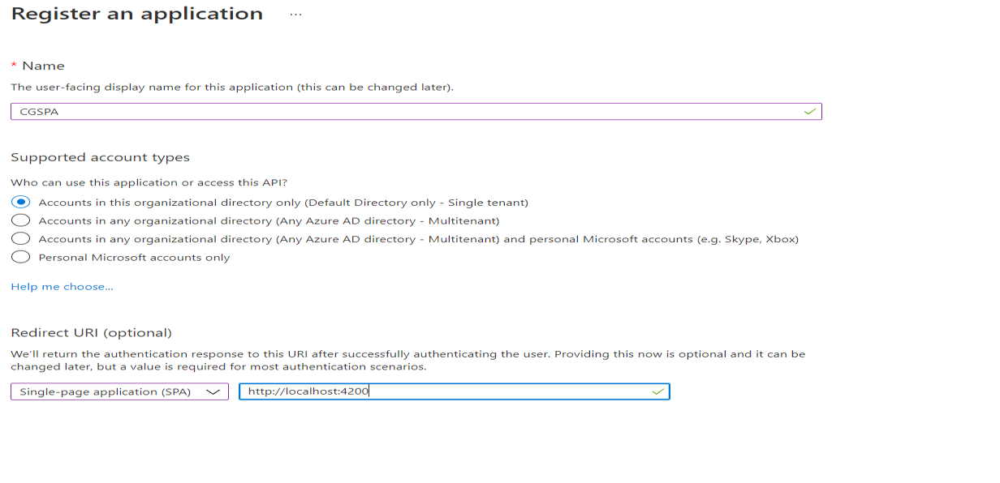
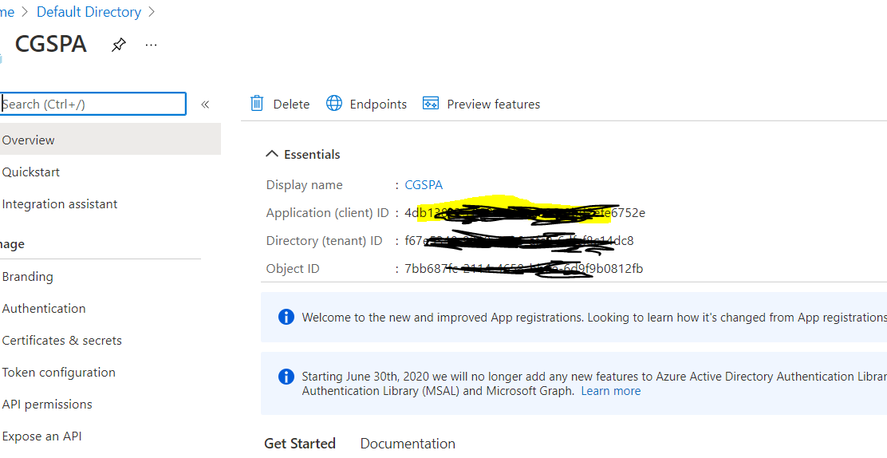
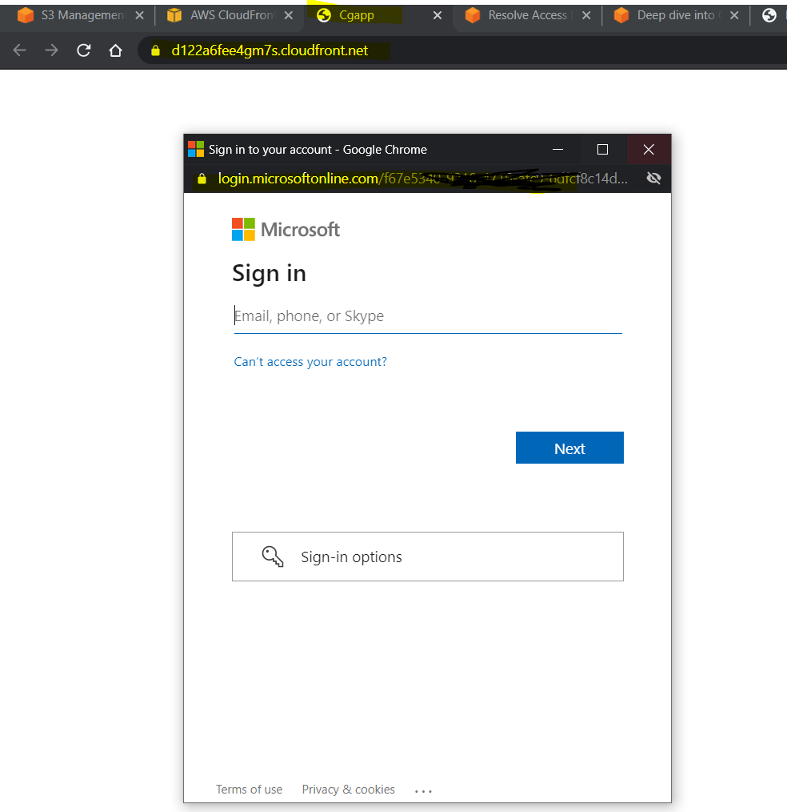

# Cgapp

## Register App on Azure
1. Login Azure AD, go to App Registration -> Click New Registration

1. Make a note of `Client ID` and `tennant ID`

1. Enable ID token, Go to Application -> Authentication-> click ID token


## Create a Angular app with routing (Unsecured)
1. Create a app `ng new cgapp --routing`
1. Delete app.component.html content and just keep `<router-outlet></router-outlet>`
1. Create a component `ng g c home`
1. Update `app.routing.module.ts` file to display Home component on default path
```
{
    path: '',
    component: HomeComponent
  }
```
1. Run `ng serve` and it should bring angular app

## Configuartion needed for MSAL 1.0
1. Using [Sample App](https://github.com/AzureAD/microsoft-authentication-library-for-js/blob/dev/samples/msal-angular-v2-samples/angular11-sample-app), update package.json file to include msal dependencies :-
```
    "@azure/msal-angular": "^1.1.2",
    "msal": "^1.4.4",
```
1. Break app and run `npm install`
1. Run `ng serve` and application still be unsecured.
1. Update `app.routing.module.ts` and add auth Gaurd
```
 canActivate: [MsalGuard]
```
1. Update configuration in `app.module.ts` to talk to Azure AD
1. Run `ng serve` and it should bring up a secure angular app, you might want to enable pop-up.

## Put this code to AWS
1. Go To S3 and create a bucket with public access disable
1. Add a tag `sse-s3` and choose `Amazon S3 Key (SSe-S3)` encryption option
1. Go to cloudfron and `Create a distribution`
1. Choose S3 bucket, restrict Bucket Access, Create a New identity, Update Bucket Policy
1. Click on distribution and make a note of domain name `https://d122a6fee4gm7s.cloudfront.net/`
1. Go to `app.module.ts` file and update redirect url `localhost:4200` to new url `https://d122a6fee4gm7s.cloudfront.net/`
1. Run `ng build --prod` to create a minify version on application.
1. Upload files from `dist` folder
1. Go to Azure AD -> Authentication -> ADD URI -> and add `https://d122a6fee4gm7s.cloudfront.net/`
1. Go to ClodFront -> Choose your distribution -> Errors -> Add index.html for 403 and 404
1. Create a Invalidation to clear cache.
1. Final add that will be secure, it takes like 15 mins to app working because of cloud front.


